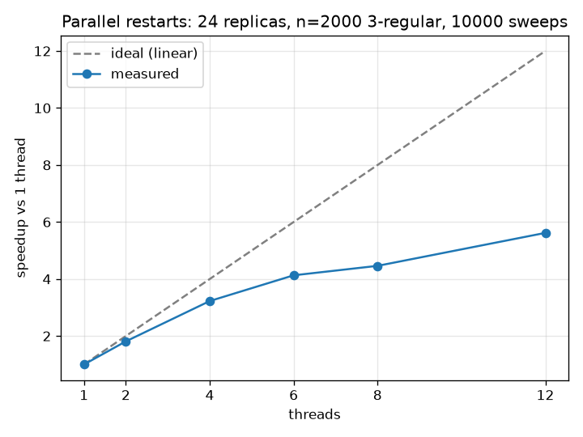
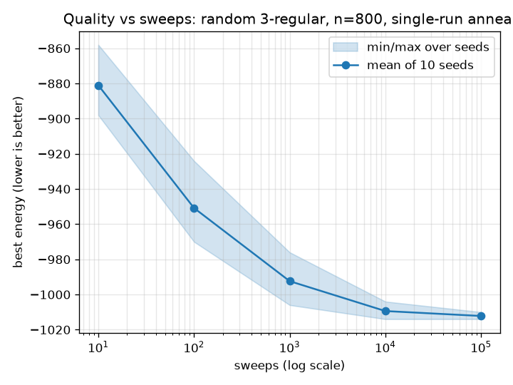
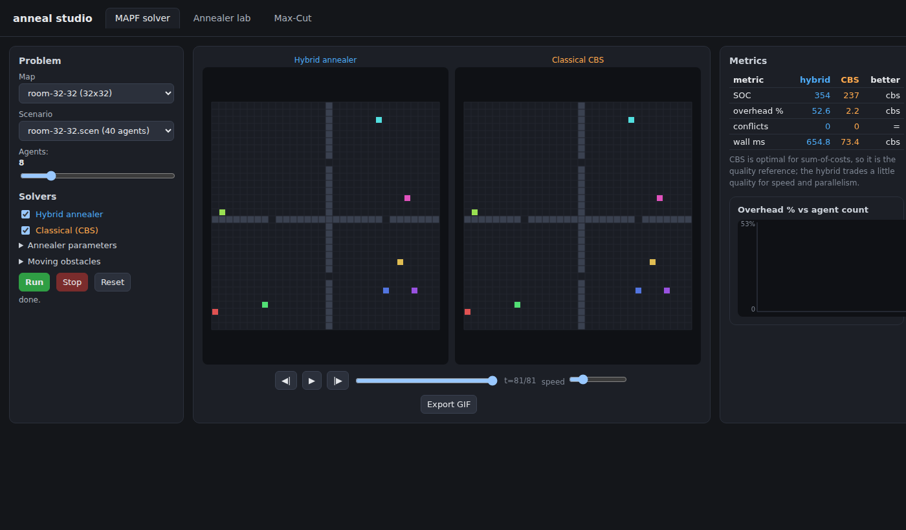
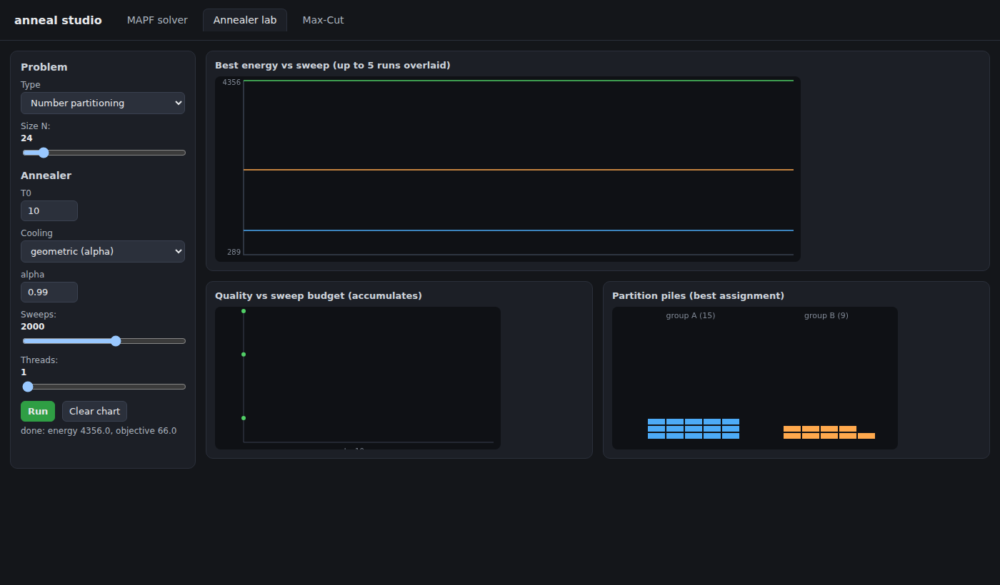
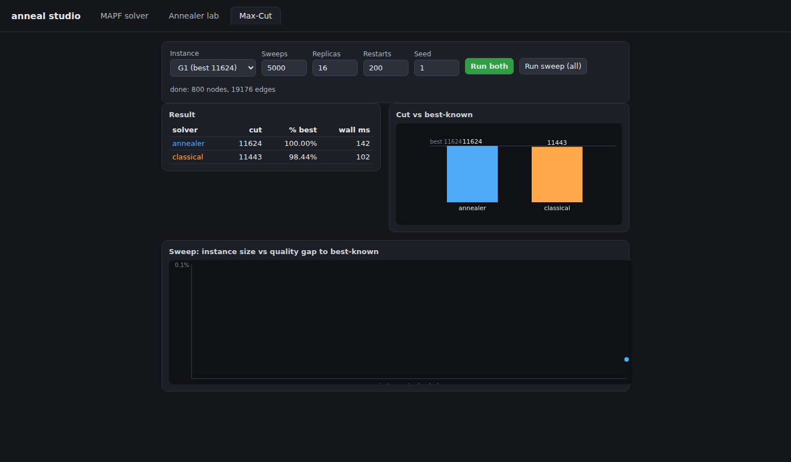
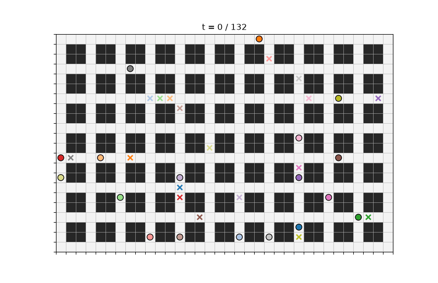
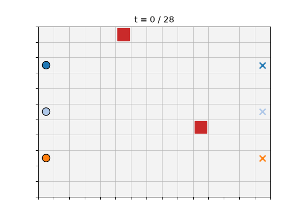

# Description

A multithreaded simulated annealing library in C++20 for hard combinatorial optimization problems, using the Ising/QUBO model format of quantum annealers. Includes a downstream application: a hybrid Multi-Agent Path Finding solver built on the library.
 
Zero dependencies. Header-only core.
 
## Status

Complete. The project covers the full arc: the annealing library (BQM with
exact Ising/QUBO conversion, fast single-thread annealer, parallel restarts,
plus parallel tempering and multi-spin coding), Max-Cut and number
partitioning with Gset benchmarks and a dwave-neal comparison, the hybrid
MAPF solver with a from-scratch CBS baseline, rolling-horizon replanning with
moving obstacles, and the interactive browser studio. See `STATUS.md` for the
per-milestone table.
 
## Quickstart
 
Requires a C++20 compiler, nothing else.
 
```
g++ -std=c++20 -Wall -Wextra -O2 -I include tests/test_bqm.cpp -o test_bqm
./test_bqm
```
 
## Example
 
```cpp
#include "anneal/bqm.hpp"
using namespace anneal;
 
// Max-Cut on a triangle: every edge wants its endpoints in different groups.
BQM bqm(3, Vartype::Spin);
bqm.add_interaction(0, 1, 1.0);
bqm.add_interaction(1, 2, 1.0);
bqm.add_interaction(0, 2, 1.0);
 
std::vector<std::int8_t> state = {+1, -1, +1};
double e = bqm.energy(state);  // -1.0, the ground state: 2 of 3 edges cut
```

## Max-Cut on Gset benchmarks

The annealer's quality is measured on the standard Gset Max-Cut instances.
Each graph maps to an Ising model (edge (u,v,w) becomes interaction
J_uv = +w); the cut is recounted independently from the edge list, never
trusted from the energy. Best-known values are the published bests
(Benlic & Hao, Engineering Applications of AI, 2013).

| instance | nodes | best-known | our cut | percent | wall |
|---|---|---|---|---|---|
| G1  |  800 | 11624 | 11624 | 100.00% | 0.5 s |
| G22 | 2000 | 13359 | 13358 |  99.99% | 1.2 s |
| G39 | 2000 |  2408 |  2399 |  99.63% | 1.7 s |
| G55 | 5000 | 10294 | 10291 |  99.97% | 3.2 s |

16 replicas x 20000 sweeps, seed 1, on a Ryzen 5 7600. Reproduce with
`./data/download_gset.sh` then `./bench/run_maxcut.sh`; details and the
brute-force correctness tests are in `bench/maxcut.md`.

```
./build/solve_maxcut data/gset/G1 --best 11624 --replicas 16 --sweeps 20000
```

## Performance

Three measurements characterize the solver: how fast the inner loop runs,
how it scales across cores, and how solution quality grows with effort.

**Throughput.** Each optimization from Isakov et al. (2015) was added one
at a time, measuring single-thread spin-flip throughput after each on a
random 3-regular graph (n=2000, +/-1 couplings). The full stack is about
**10x** faster than the naive Milestone 2 baseline; every optimized
configuration still reproduces the naive annealer's accept/reject
decisions bit for bit (differential test).

| config | flips/ns | speedup |
|---|---|---|
| naive baseline (M2) | 0.027 | 1.0x |
| flat CSR storage | 0.048 | 1.8x |
| + local field cache | 0.063 | 2.3x |
| + downhill early-exit | 0.065 | 2.4x |
| + acceptance lookup table | 0.174 | 6.4x |
| + xoshiro256++ RNG | 0.280 | 10.3x |

Full method and per-step analysis in `bench/opt_log.md`.

**Scaling.** Independent parallel restarts scale near-linearly up to the
physical core count, then flatten across hyperthreads (the hot loop is
compute-bound, so two threads sharing a core do not double throughput).



**Quality vs effort.** On a fixed instance, best energy from a single
anneal improves with sweeps and flattens into the usual diminishing-
returns curve; the band is the seed-to-seed spread over 10 seeds.



Regenerate with `./build/bench_scaling`, `./build/bench_quality`, and the
`bench/plot_*.py` scripts (plotting needs matplotlib).

### Versus dwave-neal

`neal` is D-Wave's open-source SimulatedAnnealingSampler, the standard
reference for Ising/QUBO simulated annealing. Running both on the same
Gset instances with the same budget (16 restarts x 2000 sweeps): this
solver is roughly **10-20x faster** in wall time, while neal reaches
slightly higher cuts on the two hardest instances (it auto-tunes its
temperature range per instance; ours uses a fixed geometric schedule). An
honest split -- we win on speed, neal edges quality on the hard cases.

| instance | n | best-known | ours cut | ours % | ours ms | neal cut | neal % | neal ms |
|---|---|---|---|---|---|---|---|---|
| G1  |  800 | 11624 | 11624 | 100.00% |  34 | 11624 | 100.00% |  786 |
| G22 | 2000 | 13359 | 13348 |  99.92% |  82 | 13358 |  99.99% | 1382 |
| G39 | 2000 |  2408 |  2357 |  97.88% | 102 |  2386 |  99.09% | 1261 |
| G55 | 5000 | 10294 | 10056 |  97.69% | 281 | 10270 |  99.77% | 2533 |

Reproduce with `pip install dwave-neal` then `python3 bench/neal_compare.py`
(writes `bench/neal.md`).

### Advanced samplers (Milestone 7)

Two optional additions explore alternatives to plain cooled restarts, each
correctness-tested against brute force and benchmarked honestly.

**Parallel tempering** (`include/anneal/parallel_tempering.hpp`) runs
replicas on a fixed hot-to-cold temperature ladder and swaps adjacent rungs
with the Metropolis exchange rule, so a trapped configuration can ride up to
a hot replica and escape. It finds the exact ground state on every
brute-forceable instance tested. On Gset G39 at a matched budget, though,
independent restarts reached a slightly higher cut in less wall time
(`bench/tempering.md`): parallel tempering pays off mainly on harder spin
glasses with tuned ladders and long runs, which is an honest negative result
at this project's budget.

**Multi-spin coding** (`include/anneal/multispin.hpp`) packs 64 replicas into
one uint64_t per spin and updates all 64 with bitwise operations (the "an_ms"
codes; +/-1 couplings, zero field). The per-lane unsatisfied-edge count is a
bit-sliced integer sum and acceptance is a bit-sliced fixed-point compare;
the arithmetic is verified against a scalar recomputation for all 64 lanes.
It runs 64 replicas about **3.4x faster** than 64 sequential scalar runs on a
random 3-regular instance (`bench/opt_log.md`).

## Multi-Agent Path Finding (Project 2)

The downstream application: route many agents across a grid to their
goals without collisions, using the annealer as the combinatorial core.
The approach is a hybrid decomposition (inspired by Gerlach et al., ICML
2025). Classical A* proposes a menu of candidate paths per agent; a QUBO
selects one path per agent, penalizing pairwise conflicts and enforcing
one path per agent; the annealer solves it; the plan is verified, and any
remaining conflicts trigger reservation-guided replanning and another
anneal.

### Interactive studio (Milestone 15)

`mapf/viz/serve.py` is a local web app (standard-library HTTP server, no
dependencies) that wraps the compiled C++ solvers in a three-tab browser
studio. No solver logic lives in the browser or the server; both are a
thin API layer over the same binaries the CLIs use.

```
cmake -S . -B build && cmake --build build   # builds the solvers the studio calls
python3 mapf/viz/serve.py                     # opens http://localhost:8000
```

**Tab 1 - MAPF solver.** Pick a map (`data/maps/`) and scenario
(`data/scenarios/`), set the agent count, and run the hybrid annealer,
the classical solver, or both side by side. The hybrid runs in
rolling-horizon mode and streams to the browser over Server-Sent Events:
the canvas animates the agents moving as the solver commits each window,
rather than waiting for a finished plan. With both solvers selected the
canvas splits (hybrid left, classical right) on a shared playback clock
and the metrics panel shows a side-by-side table with a "better" column.
Moving obstacles (scripted patrols or random walks) can be toggled on;
predicted obstacle cells are dodged live. An Export GIF button renders the
current plan through `render_plan.py` (needs matplotlib on the server;
everything else is dependency-free).

The classical comparison solver is **Conflict-Based Search (CBS)**,
implemented from scratch in `mapf/cbs.hpp` (Sharon et al., AIJ 2015). CBS
is optimal for sum-of-costs, so "overhead vs CBS optimal" is a meaningful
quality metric; its correctness is checked against an exhaustive
joint-space brute force on small instances in `tests/test_cbs.cpp`. On
congested maps CBS runs under a wall-clock deadline and returns its best
partial plan rather than hanging.

**Tab 2 - Annealer lab.** Run simulated annealing on number partitioning
or Max-Cut and watch the best energy fall live. Up to five runs' energy
trajectories overlay so different `T0` / cooling / sweep-budget choices
are directly comparable; a quality-vs-sweeps scatter accumulates across
runs to show the diminishing-returns curve, and a speedup bar reports
measured wall-time speedup when threads > 1.

**Tab 3 - Max-Cut.** The annealer versus classical multi-start 1-opt on a
Gset instance: cut value, percent of best-known, and wall time side by
side, with a bar chart and a "run sweep" button that scatters instance
size against the quality gap.

Backend API: `GET /api/maps`, `GET /api/scenarios?map=`, `POST /api/solve`
and `POST /api/anneal` (start a background job, return a `job_id`),
`GET /api/status|result/{id}`, `POST /api/cancel/{id}`, and
`GET /api/stream/{id}` (the Server-Sent Events feed). The C++ solvers
`solve_stream` and `anneal_stream` emit newline-delimited JSON that the
server forwards as SSE.

The three tabs, driven by a headless browser (regenerate with
`python3 mapf/viz/screenshots.py`):





### Static GIFs

For a fixed result, render a plan to an animated GIF directly:

```
./build/solve_mapf mapf/viz/demo_crossing.map mapf/viz/demo_crossing.scen 6 --out plan.txt
python3 mapf/viz/render_plan.py plan.txt --out plan.gif
```

The two demos below are six agents crossing an open grid (head-on and
diagonal) and five agents moving between four rooms through single-cell
doorways. Colored dots are agents; the matching X marks each agent's
goal.


Regenerate the demo plans and GIFs with `./mapf/viz/make_demos.sh` (needs
the project built and Python with matplotlib).

## Real-time replanning (Project 3)

The static solver plans every path once up front. Real deployments cannot:
agents keep getting new tasks and the world keeps changing. The
rolling-horizon driver (`mapf/rolling.hpp`, RHCR-style after Li et al.,
AAAI 2021) replans continuously under a global clock. Each cycle it plans
a window of W timesteps from the agents' current positions, resolves
conflicts only within that window (a small QUBO), commits the first E < W
steps, and looks again. The annealer runs under a per-cycle wall-clock
deadline and returns its best-so-far when time is up (anytime use). In
lifelong mode an agent that reaches its goal is immediately handed a new
one, so the agents never stop.

The committed history is always collision-free (each cycle commits only
the longest conflict-free prefix it verified, and falls back to holding
position if even the first step would collide); throughput is what
degrades under congestion, and it is reported honestly. The GIF below is 18
agents running lifelong in a warehouse (2x2 shelf blocks with one-cell
aisles, the RHCR robot-warehouse layout), produced by `demo_rolling`. Each
agent is a colored dot with a motion trail; the dashed leash runs to its
current goal (the matching X), which is reassigned to a new task the instant
the agent arrives, so you can watch the leash snap and the agent re-route in
real time:

```
./build/demo_rolling data/maps/warehouse-34-22.map 16 --steps 120 --window 10 \
  --execute 3 --deadline 25 --seed 3 --out lifelong.plan
python3 mapf/viz/render_plan.py lifelong.plan --map data/maps/warehouse-34-22.map \
  --out lifelong.gif --fps 6
```



### Moving obstacles

The last piece is other things that move on their own. This is the
robot-soccer setting that motivates the whole project: a robot has to get
to a spot on the field while teammates, opponents, and the ball move
independently. Obstacles carry a predicted occupancy over the planning
window (exact for scripted movers, or a ball around the current cell that
grows with look-ahead when motion is uncertain), and those predicted
cells are forbidden in candidate generation, so the time-expanded A*
either routes around a mover or waits for it to pass. If a prediction is
violated at execution time, the affected agent brakes (holds) for that
step. `demo_obstacles` sends three agents across a field past two
patrolling obstacles; with perfect prediction and room to move they reach
their goals with zero collisions of either kind:



Replan cycle time and throughput as the field fills up are in
`mapf/bench/rolling.md` (about 5 ms per cycle at 2 agents, 40 ms at 32).
Agent-agent safety is unconditional; agent-obstacle avoidance is
guaranteed with perfect prediction as long as agents are free to move, and
degrades gracefully (reported, not hidden) under heavy congestion.

Solve a scenario yourself:

```
cmake -S . -B build && cmake --build build
./build/solve_mapf mapf/viz/demo_crossing.map mapf/viz/demo_crossing.scen 6 --out plan.txt
```

The solver prints success, sum-of-costs, overhead versus the sum of
per-agent shortest paths, and wall time. Every reported result is
re-checked by an independent verifier. Success rate versus number of
agents on three maps is in `mapf/bench/results.md`.

## Ising, QUBO, and the quantum-annealing connection

The library speaks the same problem format as a quantum annealer. An Ising
model has spins s_i in {-1, +1} and energy E(s) = sum_i h_i s_i + sum_{i<j}
J_ij s_i s_j; the equivalent QUBO uses binary x_i in {0, 1}. This repo's
`BQM` stores either form and converts between them exactly (verified by
enumerating every state of small instances). A huge range of NP-hard
problems have compact Ising/QUBO encodings -- Max-Cut, number
partitioning, graph coloring, and many more are catalogued by Lucas
(2014).

That format is exactly what D-Wave's quantum annealers minimize in
hardware: they relax a system of coupled qubits toward the ground state of
a programmed Ising Hamiltonian. Simulated annealing (this project) is the
classical counterpart -- it explores the same energy landscape with
Metropolis spin flips and a cooling schedule instead of quantum
tunnelling. Writing a problem as a BQM here means the same model could be
handed to quantum hardware unchanged, which is why the solver is branded
as a general Ising/QUBO optimizer rather than a one-problem tool.

The MAPF application is a hybrid classical/quantum-style decomposition in
that spirit (inspired by Gerlach et al., ICML 2025): classical search
generates structure (candidate paths, the conflict graph) and the annealer
solves the compact QUBO subproblem of choosing one conflict-free path per
agent. The same subproblem could be dispatched to a quantum annealer; here
it runs on the classical solver in this repo.

## References

- Kirkpatrick, Gelatt, Vecchi, "Optimization by Simulated Annealing",
  Science 1983 -- the annealing method itself.
- Isakov, Zintchenko, Ronnow, Troyer, "Optimised simulated annealing for
  Ising spin glasses", Comp. Phys. Comm. 2015 (arXiv:1401.1084) -- the
  single-thread optimizations in `bench/opt_log.md`.
- Lucas, "Ising formulations of many NP problems", Frontiers in Physics
  2014 -- the Ising/QUBO problem encodings.
- Sharon, Stern, Felner, Sturtevant, "Conflict-based search for optimal
  multi-agent pathfinding", Artificial Intelligence 2015 -- the classical
  CBS solver in `mapf/cbs.hpp`.
- Li et al., "Lifelong Multi-Agent Path Finding in Large-Scale
  Warehouses", AAAI 2021 -- the rolling-horizon (RHCR) replanning scheme.
- Gerlach et al., "Hybrid Quantum-Classical Multi-Agent Pathfinding",
  ICML 2025 -- the hybrid decomposition the MAPF solver follows.
