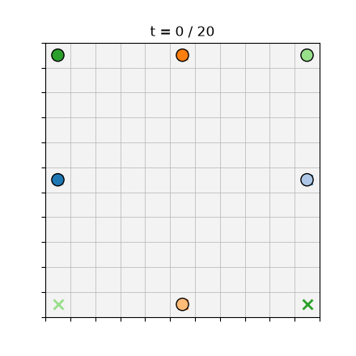
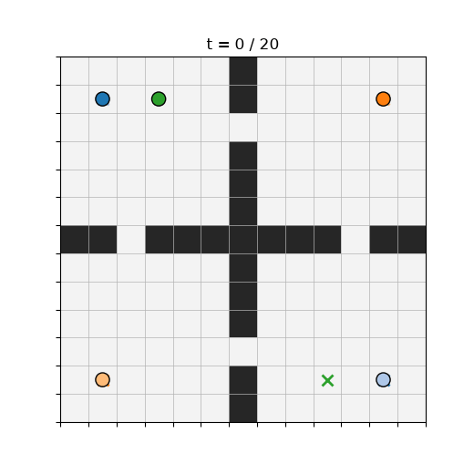

# Description

A multithreaded simulated annealing library in C++20 for hard combinatorial optimization problems, using the Ising/QUBO model format of quantum annealers. Includes a planned downstream application: a hybrid Multi-Agent Path Finding solver built on the library.
 
Zero dependencies. Header-only core. Work in progress, built milestone by milestone (see PROJECT_SPEC.md for the full roadmap).
 
## Status
 
Done so far: the BQM problem container with exact Ising/QUBO conversion, exhaustively tested by enumerating all 2^n states of small random instances.
 
Next up: the annealing engine, single-thread performance work, parallel restarts, and Max-Cut on standard Gset benchmark instances.
 
## Quickstart
 
Requires a C++20 compiler, nothing else.
 
```
g++ -std=c++20 -Wall -Wextra -O2 -I include tests/test_bqm.cpp -o test_bqm
./test_bqm
```
 
## Example
 
```cpp
#include "anneal/bqm.hpp"
using namespace anneal;
 
// Max-Cut on a triangle: every edge wants its endpoints in different groups.
BQM bqm(3, Vartype::Spin);
bqm.add_interaction(0, 1, 1.0);
bqm.add_interaction(1, 2, 1.0);
bqm.add_interaction(0, 2, 1.0);
 
std::vector<std::int8_t> state = {+1, -1, +1};
double e = bqm.energy(state);  // -1.0, the ground state: 2 of 3 edges cut
```

## Multi-Agent Path Finding (Project 2)

The downstream application: route many agents across a grid to their
goals without collisions, using the annealer as the combinatorial core.
The approach is a hybrid decomposition (inspired by Gerlach et al., ICML
2025). Classical A* proposes a menu of candidate paths per agent; a QUBO
selects one path per agent, penalizing pairwise conflicts and enforcing
one path per agent; the annealer solves it; the plan is verified, and any
remaining conflicts trigger reservation-guided replanning and another
anneal.

### Interactive GUI

`mapf/viz/serve.py` is a small local web app (standard-library HTTP
server, no dependencies) for building and solving MAPF instances by hand:

```
cmake -S . -B build && cmake --build build   # so the server can call solve_mapf
python3 mapf/viz/serve.py                     # opens http://localhost:8000
```

In the browser you can load a bundled map or a demo scenario, or draw
your own: click to place agent start/goal pairs, toggle obstacles, and
set the annealer budget. Press Solve and the server runs the compiled
`solve_mapf` on your instance and streams the plan back; the canvas then
animates it with play, pause, step, scrub, speed, and loop controls, and
shows sum-of-costs, overhead, conflicts, and wall time. A Download GIF
button exports the current plan (that step needs matplotlib on the
server; everything else is dependency-free).

### Static GIFs

For a fixed result, render a plan to an animated GIF directly:

```
./build/solve_mapf mapf/viz/demo_crossing.map mapf/viz/demo_crossing.scen 6 --out plan.txt
python3 mapf/viz/render_plan.py plan.txt --out plan.gif
```

The two demos below are six agents crossing an open grid (head-on and
diagonal) and five agents moving between four rooms through single-cell
doorways. Colored dots are agents; the matching X marks each agent's
goal.




Regenerate the demo plans and GIFs with `./mapf/viz/make_demos.sh` (needs
the project built and Python with matplotlib).

Solve a scenario yourself:

```
cmake -S . -B build && cmake --build build
./build/solve_mapf mapf/viz/demo_crossing.map mapf/viz/demo_crossing.scen 6 --out plan.txt
```

The solver prints success, sum-of-costs, overhead versus the sum of
per-agent shortest paths, and wall time. Every reported result is
re-checked by an independent verifier. Success rate versus number of
agents on three maps is in `mapf/bench/results.md`.
