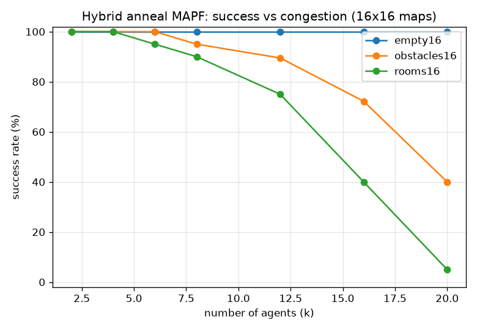

# Milestone 11 evaluation: success vs congestion

Standard MAPF protocol: fix a map, grow the number of agents k, and
measure the fraction of random scenarios the solver resolves conflict-
free. 20 random scenarios per (map, k); success is judged by the
verifier, not the solver's own flag. Overhead and wall time are averaged
over the successful runs. Solver budget: 5 candidates/agent, 3000 sweeps,
12 replicas, up to 12 re-anneal rounds.

Maps are 16x16 and synthetic (this environment is offline, so real
MovingAI instances are not downloaded; the download step is deferred with
Milestone 5). The methodology is the standard one regardless.

Reproduce: `./build/bench_mapf > mapf/bench/results.csv` then
`python3 mapf/bench/plot_success.py`. Machine: AMD Ryzen 5 7600, WSL2.

| map | k=2 | k=4 | k=6 | k=8 | k=12 | k=16 | k=20 |
|---|---|---|---|---|---|---|---|
| empty16     | 100% | 100% | 100% | 100% | 100%  | 100%  | 100% |
| obstacles16 | 100% | 100% | 100% |  95% |  90%  |  72%  |  40% |
| rooms16     | 100% | 100% |  95% |  90% |  75%  |  40%  |   5% |

## Reading the curve

- **Empty map: 100% throughout.** With 256 open cells and up to 20
  agents there is almost always slack to route around a crossing, and the
  diverse candidate menu plus one or two re-anneal rounds finds it every
  time. Overhead stays under ~11%.
- **Obstacles and rooms: graceful decline.** As agents crowd a
  constrained map the chance that some pair has no conflict-free pair of
  candidates within the menu rises, and success falls off. The rooms map
  is hardest: its doorways are single-cell bottlenecks that many agents
  must share, exactly the structure that makes MAPF hard. Overhead among
  the successful runs climbs (agents take longer detours) as expected.
- **Wall time grows with k and with congestion**, from a few ms at k=2 to
  a few hundred ms at k=20, driven by more variables in the QUBO and more
  re-anneal rounds on the harder instances.

This is the expected shape for a decomposition-based MAPF solver: strong
where there is room, degrading honestly under congestion rather than
returning invalid plans. Pushing the high-k rooms numbers up is future
work (larger menus, time-indexed reservations, or a stronger sub-solver).
