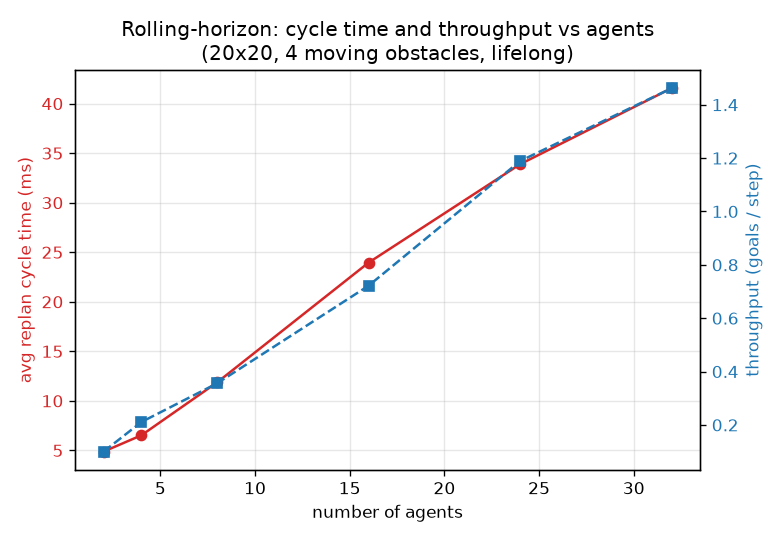

# Milestone 14: rolling-horizon with moving obstacles

Replan cycle time and throughput as the number of agents grows, on a
20x20 grid with four patrolling obstacles, lifelong mode (agents get a new
random goal on arrival). Fixed sweep budget with the anytime deadline off,
so the cycle time reflects the algorithm's own cost rather than an imposed
limit. Perfect obstacle prediction. Machine: AMD Ryzen 5 7600, WSL2.

Reproduce: `./build/bench_rolling > mapf/bench/rolling.csv` then
`python3 mapf/bench/plot_rolling.py`.

| agents | avg cycle ms | throughput (goals/step) | obstacle hits |
|---|---|---|---|
| 2  |  4.9 | 0.10 | 0 |
| 4  |  6.5 | 0.21 | 1 |
| 8  | 11.9 | 0.36 | 1 |
| 16 | 24.0 | 0.72 | 8 |
| 24 | 33.9 | 1.19 | 8 |
| 32 | 41.6 | 1.46 | 11 |

## Reading it

- **Cycle time grows roughly linearly** with agent count (about 5 ms at 2
  agents to 42 ms at 32). Each agent adds candidate variables to the
  per-cycle QUBO, and conflict edges grow with agent density, so the anneal
  and the candidate generation both cost more. At ~40 ms per cycle a
  32-agent field still replans about 25 times a second.
- **Throughput rises** with agents (more agents complete more goals per
  step) but sub-linearly: congestion forces detours and holds.
- **Obstacle hits appear only under congestion.** With perfect prediction
  and room to move, agents dodge every obstacle (0 hits at 2-8 agents).
  As the field crowds, agents occasionally get gridlocked into holding a
  cell an obstacle then sweeps through: the braking rule cannot help an
  agent that has nowhere safe to go. Agent-agent safety is never violated
  (the verifier passes on every run); these are agent-obstacle overlaps,
  reported honestly as a measure of how congestion erodes the prediction
  guarantee. Larger prediction radii and lower agent density both drive
  this back to zero.
